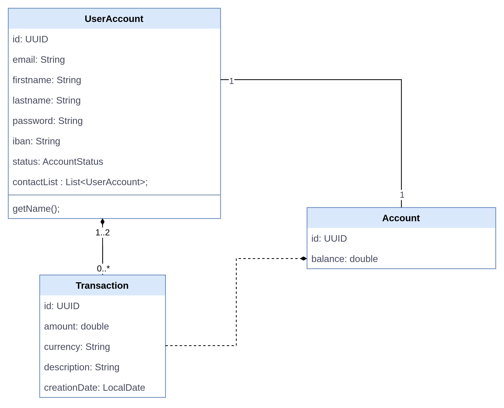
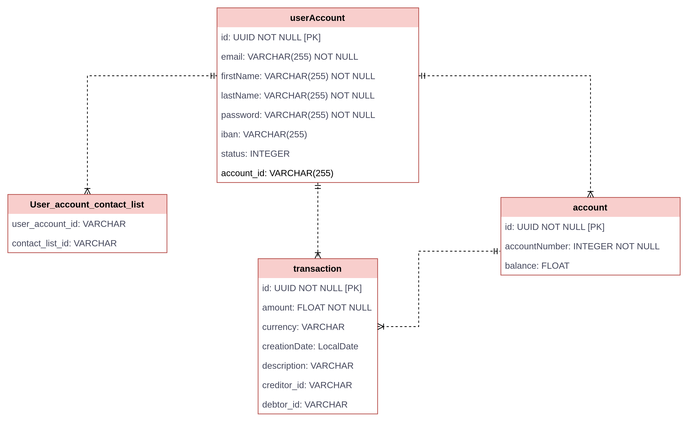

# PAY MY BUDDY


**JAVA** : 8

**SPRINGBOOT** : 2.6.8

**MAVEN** : 3.9.0

---

Pay my buddy is a web application used to transfer money between friends.

---
## HOW TO USE
**Clone the project**
<br>`git clone https://github.com/panadesign/payMyBuddy.git`

**Run application**
<br>In command line, go to the root of the project and execute:
<br>**mvn spring-boot:run**

**H2** for develop : ```mvn clean package -Pdev``` to use dev profile

http://localhost:8080
http://localhost:8080/h2-console

You can now connect to the application with this user :
<br>**Email:** demo@mail.com
<br>**Password:** demo

There is another userAccount you can use for your test:
<br>**Email:** test@mail.com
<br>**Password:** test

If you want you can also create your own account.

---

### You can also use a mysql database
**Create a new mysql database with:**
<br>CREATE DATABASE payMyBuddy;
<br>USE payMyBuddy;

And after use this SQL script:
<br>
create table account
(
id      varchar(255) not null
primary key,
balance double       null
)
collate = utf8mb4_0900_ai_ci;

create table user_account
(
id         varchar(255) not null
primary key,
email      varchar(255) not null,
firstname  varchar(255) null,
iban       varchar(255) null,
lastname   varchar(255) null,
password   varchar(255) null,
status     int          null,
account_id varchar(255) null,
constraint UK_hl02wv5hym99ys465woijmfib
unique (email),
constraint FK1pxs5fj6ujqfs13gmfg3o5cwo
foreign key (account_id) references account (id)
)
collate = utf8mb4_0900_ai_ci;

create table transaction
(
id            varchar(255) not null
primary key,
amount        double       not null,
creation_date date         null,
currency      varchar(255) null,
description   varchar(255) null,
creditor_id   varchar(255) null,
debtor_id     varchar(255) null,
constraint FK8bb8hnetlj2hmwj4fx3jp8iv
foreign key (debtor_id) references user_account (id),
constraint FKruht95n0m2jj20g7oy2ujxbwg
foreign key (creditor_id) references user_account (id)
)
collate = utf8mb4_0900_ai_ci;

create table user_account_contact_list
(
user_account_id varchar(255) not null,
contact_list_id varchar(255) not null,
constraint FK6194qk5c55hi0m58wncgrobc2
foreign key (contact_list_id) references user_account (id),
constraint FKhrt5olahysud33axbuvphhcb5
foreign key (user_account_id) references user_account (id)
)
collate = utf8mb4_0900_ai_ci;


---

## Diagramme de classe UML


---

## Modèle physique de données
